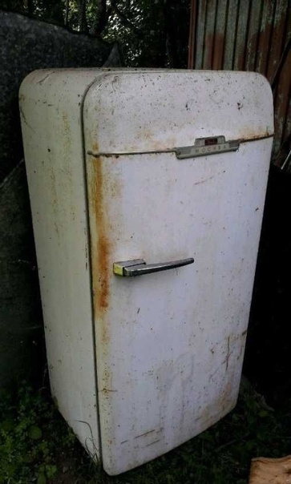

  

**SmartFridge: QR Control & IoT Sync** - это приложение для инвентаризации "Холодильника" в кафе, разработанное в рамках московской предпрофессиональной олимпиады

---

## 🗂️ Оглавление

- [📥 Установка приложения (Android)](#-установка-приложения-android)
- [📦 Исходный код](#-исходный-код)
- [📺 Видео](#-видео)
- [👥 Команда разработки](#-команда-разработки)

## 📥 Установка приложения (Android)
### Шаг 1: Установка APK из релизов
1. Перейдите в раздел [**Releases**](https://github.com/Proman2702/mppo_app/releases/).
2. Выберите последнюю доступную версию приложения.  
3. Скачайте файл с расширением `.apk` из выбранного релиза.

### Шаг 2: Настройка Android
Разрешите установку из неизвестных источников:  
- **Настройки → Безопасность** (или **Приложения → Специальный доступ**)  
- Включите **Установка неизвестных приложений**

### Шаг 3: Установка
1. Откройте APK через файловый менеджер.  
2. Нажмите **Установить** → дождитесь завершения.  
3. Готово! Приложение появится в списке программ.

### 📦 Исходный код
Архивы (`*.zip`, `*.tar.gz`) содержат код для разработчиков. Для обычной установки они **не нужны**.

## 📺 Видео
[▶ Посмотреть видео об использовании приложения на Rutube](https://rutube.ru/video/private/7cce0e20e3981a1dc5005a50df5ad927/?p=buD95d-bBDBwgdiemcXllg)

## 👥 Команда разработки 
**Павел Кравцов** - *главный разработчик*

**Денис Давыдов** - *инвалид*

**Владислав Агафошин** - *мегамозг*

**Юрий голышев** - *мегамозг*

**Александр Кулагин** - *летописец древней руси*
